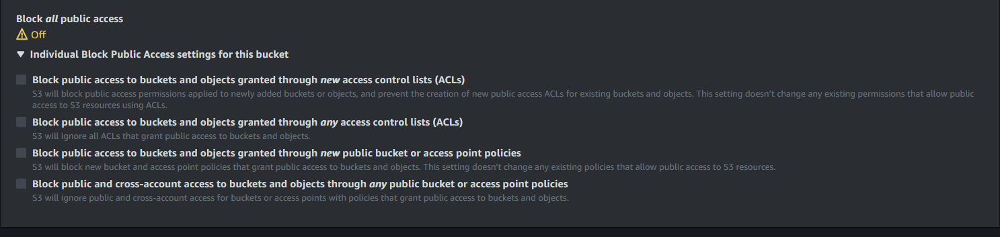

# Workspace

Welcome to the Workspace's backend repository! This project aims to provide a solution for managing discussions within a workspace environment. It is built using ExpressJS, a popular Node.js framework for building web applications and APIs, coupled with PostgreSQL as our database of choice and Redis as caching layer.

This project facilitates real-time communication between users.
#### Features:
   + **Workspace:** A collection of channels. Channels cannot exist independently; they must belong to a workspace.
   + **Channel:** The space where users engage in real-time communication.


#### Normal Flow:
   1. A user creates a workspace.
   2. Channels are created within the workspace.
   3. The workspace creator can add users to specific channels.
   4. Users can then communicate with each other in real-time within these channels.
   5. Users can also send attachments along with their messages.


## Setup Instructions

To set up the Workspace backend locally, follow these steps:

#### 1. Clone The Repo:
   
   ```bash
   git clone https://github.com/CodeQuotient/workspace.git
   ```
   
   OR

   ```bash
   gh repo clone CodeQuotient/workspace
   ```
#### 2. Install Dependencies:

   ```bash
   cd workspace && npm i
   ```
#### 3. Config Enviroment Variable

   1. In the root directory create ```.env``` file.
   2. Please Check ```.env.example``` for the required fields.
   3. For local development ```.env.example``` data can be used directly, copy ```.env.example``` data into ```.env``` file.
   4. Set your PostgreSQL and Redis password in .env file. 


#### 4. Config Database
   1. Install PostgreSQL on your computer if you haven't already. You can download it from the [official PostgreSQL website.](https://www.postgresql.org/download/)
   2. Create a new database named "workspace" within PostgreSQL. You can do this using a PostgreSQL administration tool like pgAdmin or by running SQL commands in your terminal.
   3. Replace placeholders in the package.json file with your actual credentials. Look for <user> and <password> placeholders and substitute them with your PostgreSQL username and password respectively.
   4. Ensure PostgreSQL is running on the correct port. By default, PostgreSQL runs on port 5432. If your PostgreSQL instance is running on a different port, make sure to update the configuration accordingly
   5. After configuring your database, navigate to the project directory in your terminal.
   6. Run migrations using the following command:
   ```bash
      npm run up
   ```

#### 5. Starting Server

   ```bash
   npm run start:dev
   ```

   Can be used to start the server.
   By default it will start on port 5555, but can be changed by providing port.

   ###### Example :->

   ```bash
   npm run start:dev 6000
   ```
   
   This will start server on port 6000

## Contribution Guidlines

If you'd like to contribute to this project, feel free to submit pull requests or open issues. Please follow the exisiting code styles and ensure your changes are well-tested.


<hr>

#### Sending Email

For local development, you can utilize [Etherial Mail](https://ethereal.email/), a simulated SMTP service. It functions as a faux mail delivery system, meaning no emails are actually sent; instead, they are displayed in a message list for inspection. You can either employ the pre-configured account provided in the .env.example file or create your own account through the [Etherial Mail](https://ethereal.email/) website for testing purposes.

<hr>


#### Setting Up S3 for Message Attachments

Message attachments can be stored locally or in an Amazon S3 bucket. Follow these steps to configure S3:

1. **Create an AWS Account**  
   If you don't have an AWS account, sign up using [this link](https://portal.aws.amazon.com/billing/signup).

2. **Create an S3 Bucket**  
   After signing up, create an S3 bucket. Use [this guide](https://docs.aws.amazon.com/AmazonS3/latest/userguide/creating-bucket.html) as a reference.  
   **Note:** The bucket should be configured to be public.

   

3. **Set Bucket Policy**  
   Apply the following policy to your bucket to allow public access to the items:
   ```json
   {
      "Version": "2008-10-17",
      "Statement": [
         {
            "Sid": "Statement1",
            "Effect": "Allow",
            "Principal": {
               "AWS": "*"
            },
            "Action": "s3:GetObject",
            "Resource": "arn:aws:s3:::my-workspace-bucket/*"
         }
      ]
   }
   ```

<hr>

<br>
<br>

[![CC BY-NC-SA 4.0][cc-by-nc-sa-shield]][cc-by-nc-sa]

This work is licensed under a
[Creative Commons Attribution-NonCommercial-ShareAlike 4.0 International License][cc-by-nc-sa].

[![CC BY-NC-SA 4.0][cc-by-nc-sa-image]][cc-by-nc-sa]

[cc-by-nc-sa]: http://creativecommons.org/licenses/by-nc-sa/4.0/
[cc-by-nc-sa-image]: https://licensebuttons.net/l/by-nc-sa/4.0/88x31.png
[cc-by-nc-sa-shield]: https://img.shields.io/badge/License-CC%20BY--NC--SA%204.0-lightgrey.svg
